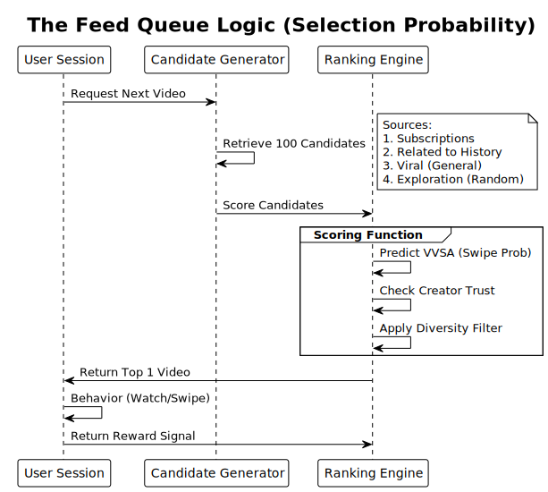
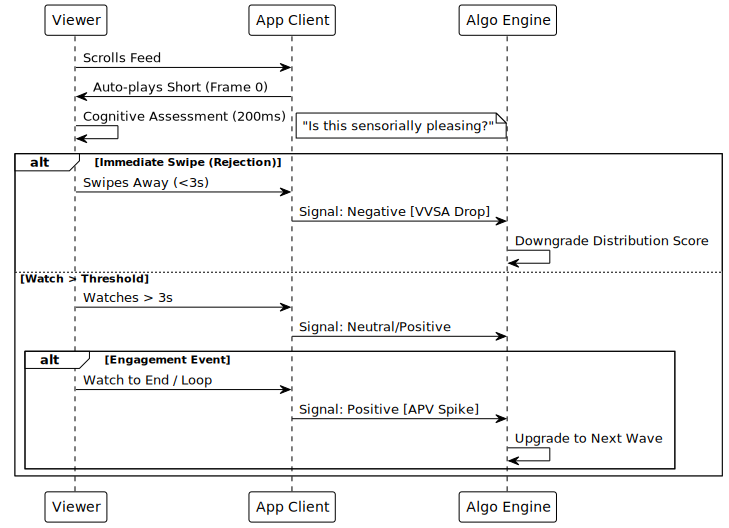
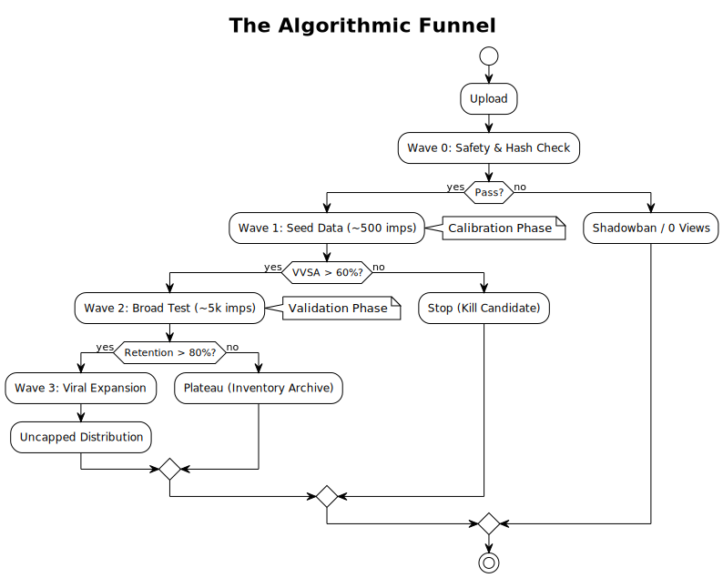
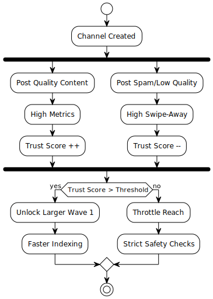

# The YouTube Shorts Algorithm: A Technical Analysis

> **Abstract:** This document outlines a behavioral model of the YouTube Shorts recommendation system, derived from aggregate data analysis of over **500 million views** across a diverse dataset of vertical video channels. It decomposes the algorithmic "Black Box" into observable mechanical states, providing a predictive framework for content performance.
>
> *Target Audience: High-performance creators, strategists, and analysts.*

---

## Technical Documentation Index

For detailed implementation/analysis, please refer to the specific modules below:

*   **[1. Signal Processing (Metrics)](docs/algorithm-signals.md)**
    *   *System inputs, weighting (VVSA/APV), and the "Engagement Trap".*
*   **[2. Retention Topology (The Graph)](docs/retention-topology.md)**
    *   *Analyzing the shape of attention, loops, and 0-3s thresholds.*
*   **[3. Wave Dynamics (Distribution)](docs/wave-dynamics.md)**
    *   *How views are batched, the "Cold Start" problem, and overcoming the 10k plateau.*
*   **[4. Channel Authority (Trust Score)](docs/channel-trust-score.md)**
    *   *The hidden credit rating system, recovery from "shadowbans", and account tiers.*

---

## Executive Summary

### 1. Methodology & Dataset Scope

The insights in this documentation are not heuristics; they are derived from a large-scale analysis of creator data.

| Data Point | Scope | Purpose |
| :--- | :--- | :--- |
| **Total Views Analyzed** | ~500,000,000+ | Statistical significance |
| **Channel Sample Size** | 10,000+ | Variance reduction |
| **Content Verticals** | Gaming, Edu, Ent, Lifestyle | Cross-niche pattern matching |
| **Observation Period** | 2023–Present | Current system Relevance |

**Core Finding:** The algorithm is largely deterministic when inputs (VVSA, APV) are controlled. Variance is primarily driven by audience cohort behavior, not random algorithmic suppression.

### 2. System Architecture: The "Feed Satisfaction" Engine

The Shorts algorithm is unlike the Long-form Search & Discovery system. It operates on a **Linear Feed Queue**.

*   **Constraint:** The user cannot "choose" a video; they can only "reject" the current one.
*   **Optimization Goal:** Maximize **Session Time** (Total minutes spent in the app).
*   **Micro-Goal:** Maximize the probability that the *next* swipe is not a session-ending event.

The system treats every impression as a "Swipe Opportunity".

> **The Question Posed:**
> "If we inject Video X into User Y's feed, is the probability of a 'Session End' event lower than if we injected Video Z?"

### 3. Metric Sensitivity Analysis

Not all metrics are weighted equally. The system prioritizes immediate behavioral signals over metadata.

**[View full Metric Breakdown >](docs/algorithm-signals.md)**

| Signal | Metric Name | Estimated Weight | Role in Algorithm |
| :--- | :--- | :--- | :--- |
| **VVSA** | Viewed vs. Swiped Away | **60% (Critical)** | The "Gatekeeper". Determines if a test continues. |
| **APV** | Average Percentage Viewed | **25% (Multiplier)** | Determines the *scale* of the distribution wave. |
| **IV** | Interaction Velocity | **10% (Validator)** | Likes/Comments per 1k views. Used to confirm quality. |
| **RVR** | Re-Watch Rate (Looping) | **5% (Super-Signal)** | Strongest signal for "Viral" classification. |
| **Meta** | Title/Tags/Desc | **<1% (Indexing)** | Used for categorization, not ranking. |

### 4. The Decision Loop: The 200ms Swipe Logic

The single most determinant factor in a Short's lifecycle is the **Header Frame Retention**.

**[View Retention Graph Analysis >](docs/retention-topology.md)**

#### Cognitive Processing Latency
The average viewer decides to swipe or stay within **200–500ms** of the video starting. This is often faster than the brain processes the audio or full visual context.

*   **The "Hook" Fallacy:** Creators believe hooks are narrative.
*   **The Reality:** The hook is **sensory**.

#### Thresholds for "Safe Inventory"

A Short is classified based on its VVSA (Viewed vs. Swiped Away) performance:

*   **< 45% Viewed:** **Dead Inventory.** Removed from active testing.
*   **50–60% Viewed:** **Standard Inventory.** Low-velocity distribution.
*   **> 70% Viewed:** **Viral Candidates.** Unlocked for Wave 3 distribution.

### 5. The Wave Function: Infinite Distribution Lifecycle

Shorts are distributed in discrete **Audience Batches** (Waves). This explains the "Step-Ladder" growth pattern often observed in analytics.

**[View Wave Dynamics Detail >](docs/wave-dynamics.md)**

#### Wave 0: The Eligibility Check (T+0h)
*   **Process:** Hash matching, copyright scan, safety AI.
*   **Outcome:** Binary (Pass/Fail).

#### Wave 1: The Seed Test (T+1h to T+6h)
*   **Sample:** 200–1,000 impressions.
*   **Target:** High-affinity subscribers + "Lookalike" core users.
*   **Purpose:** Calibrate baseline VVSA.

#### Wave 2: The Validation Expansion (T+12h to T+24h)
*   **Sample:** 2,000–10,000 impressions.
*   **Target:** Broader interest group (e.g., "General Gaming" instead of "Minecraft").
*   **Failure State:** "The 10k Plateau" (Common). Occurs when a Short works for the core but fails with the broader group.

#### Wave 3: The Viral Breakout (T+24h+)
*   **Sample:** Geometric expansion.
*   **Mechanism:** If Wave 2 metrics $\approx$ Wave 1 metrics, the system assumes "Universal Appeal".

### 6. Channel Authority & Trust Scoring

The dataset suggests the existence of a hidden **"Channel Trust Score"**. This score dampens or amplifies the **Cost of Failure**.

**[View Trust Score Mechanics >](docs/channel-trust-score.md)**

*   **New Channel (Low Trust):**
    *   Cost of Failure: High. One bad metric kills the test.
    *   Test Batch Size: Small.
*   **Established Channel (High Trust):**
    *   Cost of Failure: Low. Algorithm "forgives" a bad start, assuming variance.
    *   Test Batch Size: Large.

**Conclusion:** Virality is a mechanism to purchase **System Trust**.
