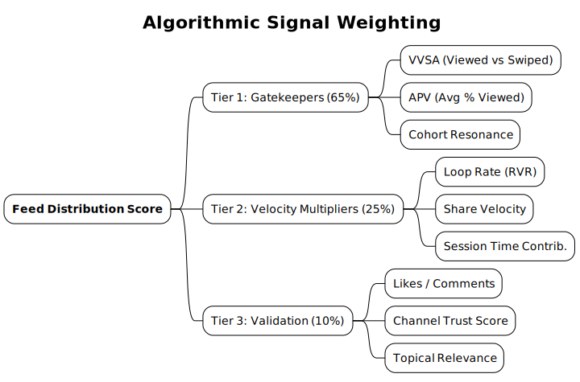

# Signal Processing: Metric Sensitivity & Weighting

> **Technical Note:** The YouTube Shorts recommendation engine operates as a **Reinforcement Learning (RL)** system. It scores candidate videos based on a predicted reward function, primarily defined by **Long-Term Session Value**.

 This document details the input signals used by the RL agent to calculate the `P(satisfaction)` score for any given impression.

---

## 1. The Hierarchy of Metrics

The algorithm does not weigh all interactions equally. We classify signals into three tiers based on their impact on the **Feed Distribution Coefficient (FDC)**.

### Tier 1: The Gatekeepers (Distribution Vetos)
*These metrics determine if a video survives the initial seed test (Wave 1).*

| Metric | Technical Name | Weight | Definition |
| :--- | :--- | :--- | :--- |
| **VVSA** | Viewed-vs-Swiped-Away | **0.65** | The percentage of distinct impressions that resulted in a `view_complete` event (>3s or >10%). |
| **APV** | Average Percentage Viewed | **0.25** | The mean completion rate relative to video duration. |
| **ACR** | Audience Cohort Resonance | **0.10** | Variance in VVSA between the "Subscriber/History" cohort vs. "Cold/Random" cohort. |

**Critical Insight:** A VVSA below **50%** is mathematically impossible to scale in the current model unless APV is >150% (extreme looping).

### Tier 2: The Multipliers (Velocity Drivers)
*These metrics determine the "Width" of the distribution funnel (Wave 2 & 3).*

| Metric | Technical Name | Weight | Definition |
| :--- | :--- | :--- | :--- |
| **RVR** | Re-Watch Rate (Looping) | **High** | Implicit signal of high dopamine response or information density. Acts as a multiplier on APV. |
| **Share_Delta** | Share Velocity | **Med** | Total shares normalized by view count. Strong indicator of "external network effects" (Dark Social). |
| **EPV** | Engagement Per View | **Low** | (Likes + Comments) / Total Views. Used primarily for "Safety" checks against clickbait. |

### Tier 3: Contextual Metadata (Indexing)
*These metrics are used for **Classification**, not Ranking.*

*   **ASR (Auto-Caption Text):** Used for topic extraction (NLP).
*   **Visual Object Detection:** Frame sampling to detect "Gaming", "Face", "Outdoors".
*   **Audio Fingerprint:** Music recognition for trending audio clusters.

---

## 2. The VVSA Formula

The system calculates a dynamic threshold for VVSA based on video duration.

$$
\text{Threshold}_{eff} = \text{BaseLine} + (\text{Duration}_{sec} \times 0.5)
$$

*   **15s Short:** Needs ~65% VVSA to break out.
*   **50s Short:** Needs ~75% VVSA to break out.

> **Paradox:** Longer Shorts require *higher* swipe retention because the "opportunity cost" of showing a 50s video is higher for the feed (it blocks 3 potential 15s videos).

---

## 3. The "Engagement Trap"

Many creators over-optimize for Likes/Comments. Our data shows a weak correlation between high Like counts and Virality.

**Graph: Correlation to View Count (r-value)**
*   **Loop Rate:** `r = 0.82` (Strong)
*   **Swipe Rate:** `r = 0.78` (Strong)
*   **Share Rate:** `r = 0.45` (Moderate)
*   **Like Rate:** `r = 0.12` (Weak)
*   **Comment Rate:** `r = 0.09` (Very Weak)

**Conclusion:** Do not ask for likes. Ask for attention.

---

## 4. Signal Decay & Freshness

Signals are not static. The `Score(t)` of a video decays over time unless refreshed by new interactions.

*   **Freshness Boost:** New uploads get a distinct multiplier for the first 6 hours.
*   **Velocity Decay:** A video with 1M views viewing getting 100 views/hour is marked as "Stale" and removed from the active "Viral" queue, moving to "Search/Library" inventory.

### The "Resurrection" Trigger
Old videos can re-enter the feed if:
1.  **Search Interest Spike:** External search volume for the topic rises.
2.  **Audio Trend:** The BGM used becomes a trending sound.
3.  **Cluster Activation:** A new viewer cohort (e.g., "People who liked Video Y") is identified as a match for your old Video X.
