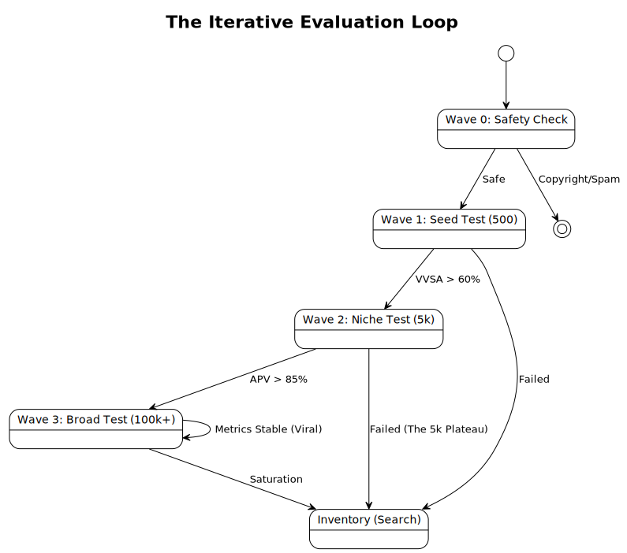

# Wave Dynamics: The Logic of Distribution

> **Core Concept:** YouTube does not "give" you views. It "loans" you test audiences. If you pay back the loan with high retention (Session Time), it extends a larger loan. This cycle repeats in "Waves".

---

## 1. The Wave Model

The distribution system is **Iterative**, not Linear.

---

## 2. Wave Breakdown

### Wave 0: The "Paperwork" Phase (T+0)
Before a human sees your video, bots analyze it.
*   **Checks:** Copyright ID, visual hash (re-upload detection), text OCR (offensive words).
*   **Outcome:** If flagged, the video gets 0 views. It is "Shadow-banned" to protect the feed safety.
*   **Duration:** 10 mins - 2 hours.

### Wave 1: The "Seed" Phase (Laboratory)
*   **Audience:** High-affinity subscribers + "Gold Standard" test users (users with predictable behavior).
*   **Goal:** Establish a baseline **VVSA**.
*   **Common Result:** ~400-1,000 views.
*   **The Trap:** If your subscribers *swipe away*, the video dies instantly. Subscribers are assumed to be "Friendly"; if *they* don't like it, strangers definitely won't.

### Wave 2: The "Niche" Expansion (Validation)
*   **Audience:** "Lookalikes". People who watch *similar* content but don't know you.
*   **Goal:** Verify **APV** and **Engagement**.
*   **Common Result:** ~5,000-10,000 views.
*   **The Plateau:** Many videos die here. This is the "Good, but not Great" zone. The content worked for the core niche but failed to hold the attention of the broader audience.

### Wave 3: The "Broad" Expansion (Virality)
*   **Audience:** Generalized buckets (e.g., "Males 18-24", "US Geography"). Less interest-based, more demographic-based.
*   **Goal:** Maximize Session Time.
*   **Result:** 100k - 100M views.
*   **Characteristic:** The "Slope" of the view graph becomes vertical.

---

## 3. The "Cold Start" Problem (New Channels)

**Myth:** "New channels get a boost."
**Reality:** New channels get **High Volatility**.

Because the system has no "User History" for the channel, it has no defined "Seed Audience" (Wave 1).
*   **Solution:** It throws the video at *random* high-volume buckets to calibrate.
*   **Effect:** You might get 2,000 views on video #1 (Lucky bucket match) and 0 views on video #2 (Unlucky match).
*   **Advice:** Do not delete/reupload. You are training the neural net on who your audience is. Deleting data resets the training.

---

## 4. The "10k View Jail" (The Plateau)

Why do so many Shorts stop exactly at ~10k views?

**The Math:**
1.  **Wave 1 (Seed):** 90% Retention (Great!) -> Promoted to Wave 2.
2.  **Wave 2 (Broad):** 70% Retention (Good!) -> Promoted to Wave 3 boundary.
3.  **Wave 3 (General Public):** 45% Retention (Bad).

When the video hit the "General Public" (Normies), they swiped. The aggregate retention dropped below the "Viral Threshold" (usually ~70% VVSA). The system immediately cuts impressions to protect the feed quality.

**Fix:** Your content is too "niche". To break 10k, you must make the topic accessible to someone *outside* your specific hobby circle.

---

## 5. Delayed Explosions (Zombie Shorts)

Sometimes a video flatlines for 30 days, then gets 1M views. Why?

**The "Inventory" Effect:**
1.  Video fails Wave 1. Stored in "Bank".
2.  3 weeks later, a *different* video on the same topic goes viral globally.
3.   The algorithm scours its "Bank" for related content to feed the new demand.
4.  Your old video is "Resurrected" and injected directly into a Wave 2 test.

**Takeaway:** Never delete "failed" videos. They are lottery tickets effective for 365+ days.
